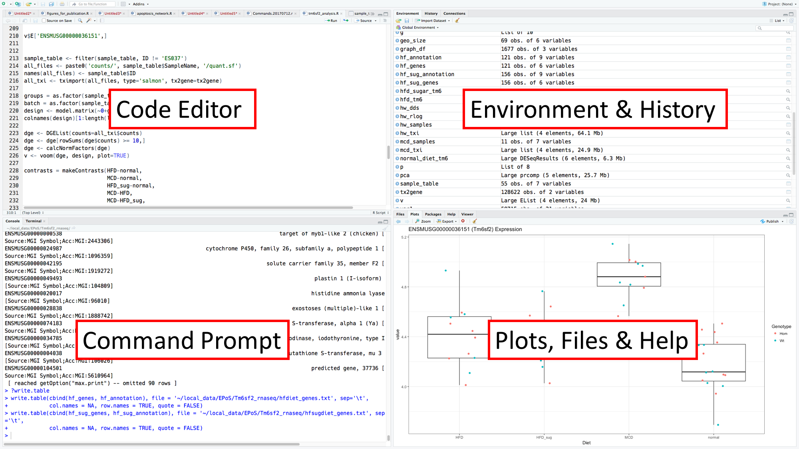
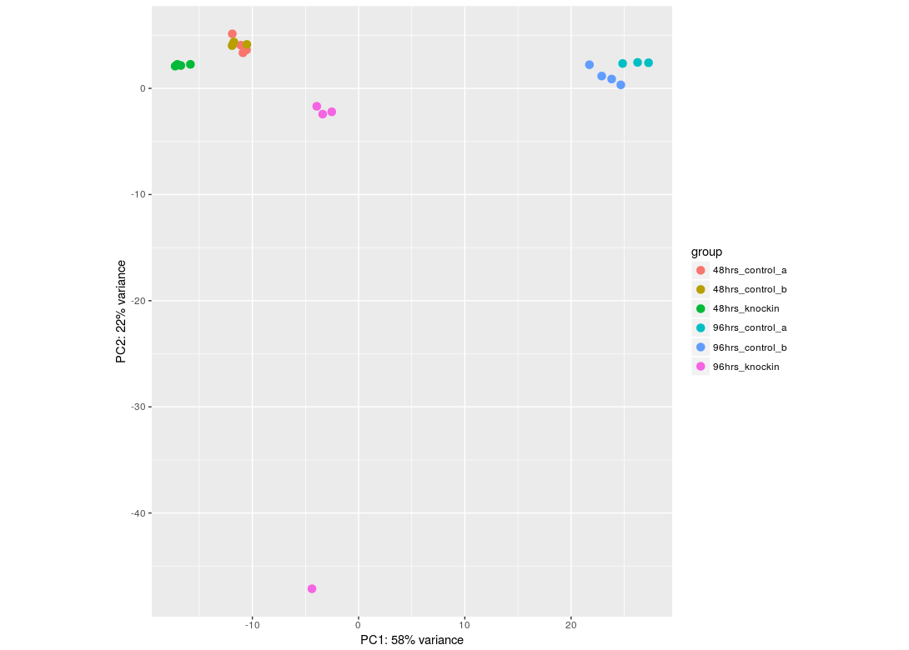
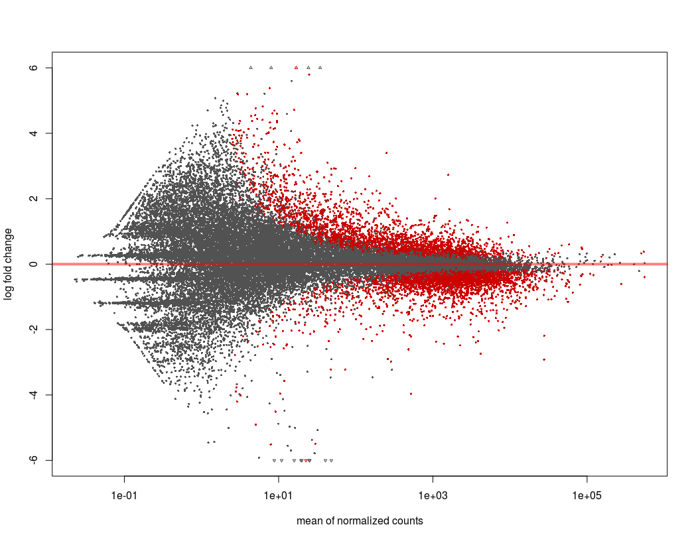

```{r setup, include=FALSE}
knitr::opts_chunk$set(echo = TRUE, cache = TRUE)
library(knitr)
library(DESeq2)
library(pheatmap)
library(gplots)
library(bsudata)
library(tidyverse)
```

# Introduction to R

R is a programming language and environment for statistical analysis and data visualisation. It is used extensively in bioinformatics because it enables the manipulation and analysis of very large data sets.

R is an extensible environment and new functionality can be added to the core language via installation of packages. There are large existing repositories of these packages for R, including the Comprehensive R Archive Network (CRAN)[^1] which includes thousands of packages covering many use-cases, and Bioconductor[^2]   which caters specifically for the analysis of biological data.

## Bioconductor

Bioconductor is an open source software project for R. It is a collection related R packages, which you can install and use in your code. These packages are tailored to perform a set of specific tasks based around a particular type of analysis.

As well as packages, the Bioconductor site also provides documentation for each package, often a brief vignette and a more comprehensive user guide.

## Tidyverse

Tidyverse[^3] is set of packages available through CRAN. It describes itself as “an opinionated collection of R packages designed for data science”. Components of the Tidyverse provide convenient methods for reading, writing, visualising and organising data.

## RStudio

RStudio[^4] is an Integrated Development Enviornment (IDE) which supports the development and running of R programs. It has a number of convenience features that make developing R code much more user-friendly. 

The RStudio interface is split into four panes as shown:

```{r external_pic1, echo=FALSE, out.width='450px'}

```

## Using R

We will be using R as a command-driven data analysis environment. R is a Turing-complete[^5] programming language capable of much more than will be demonstrated today, but that is beyond the scope of this course. 

The commands we will use in R take a general form:

`command(arguments)`

The name of the command to be executed is followed by a paranthetic, comma-separated list of arguments that provide input, or modify the behaviour of that command. The results of a command can be stored as a _variable_ by using the assignment operator (`=`):

`x = command(arguments)`

Help on a command, and the arguments it takes, can be found using the `?` operator before the name of the command:

`?command`

This help will open in the bottom right-hand pane of RStudio.

## Installing Packages

Packages provide vital extensibility to the core functionality of R. We will be using Bioconductor's package installer as a universal interface to a large number of package repositories (including Bioconductor, CRAN and Github). To install the installer, simply execute the following command in the R Console (bottom left pane of RStudio).

```{r installer, eval=FALSE}
install.packages('BiocManager')
library(BiocManager)
```
Now we have the `BiocManager` package, we can use this to install all of the other packages we need for today's exercises. 

```{r install_everything, eval=FALSE}
install(c('devtools', 'pheatmap', 
          'Bioinformatics-Support-Unit/bsudata', 
          'DESeq2', 'tidyverse'))
```

In order to make use of these packages, they must be included in our session with the `library()` command. 

```{r libraries, eval=FALSE}
library(tidyverse)
library(DESeq2)
library(pheatmap)
library(bsudata)
```

# Introduction to RNA-Seq

RNA-Seq, or Whole Transcriptome Shotgun Sequencing (WTSS) refers to the sequencing of cDNA in order to profile the RNA content of a sample. The technique takes advantage of a simple assumption – that the number of reads that map to a particular gene in a sequencing experiment is in direct proportion to both its length, and the amount of that molecule that is present in the sample. So if two RNAs of equal length are present at a ratio of 2:1 in the sample, then we will retrieve twice as many reads for one as we will for the other when we sequence the sample. So, given two samples we can normalise for transcript lengths and total number of reads, and work out which species are differentially expressed between the two samples.

RNA-Seq is often seen as a replacement for the very popular microarray approach to studying gene expression, and while the two approaches have different strengths and weaknesses, it is generally true that the data from RNA-Seq correlates better with qPCR data (the “gold standard” for measuring gene expression data) and the sheer depth of the data generated makes RNA-Seq the better choice in many circumstances - assuming the budget allows.

This also means that many of the mistakes, with regards to experimental design, that were made in the early days of microarrays are being repeated in earnest with RNA-Seq experiments. Good experimental design is out of the scope of this course, but come and speak to the BSU – as we can help you with experimental design. One of the most common false assumptions is that with RNA-Seq you don’t need replicates. This is simply untrue, we still need to model the variance of the population in order to return meaningful statistics and consequently it’s advisable to do at least 4 biological replicates per condition minimum for cell lines, more for mice/rats and many more for humans. Unlike with microarray analysis however technical replicates are seldom required, as despite the stochastic nature of sequencing runs they tend to be highly reproducible.

## TPM

TPM stands for Transcripts per Million (mapped reads), and it is a way of expressing the normalised read counts for each transcript in an RNA-Seq experiment. In order to calculate TPMs for a sample, you do the following:
  
  1. Divide the read counts by the length of each gene in kilobases. This gives you reads per kilobase (RPK).
  2. Count up all the RPK values in a sample and divide this number by 1,000,000. This is your “per million” scaling factor.
  3. Divide the RPK values by the “per million” scaling factor. This gives you TPM.

In practice, however, we rarely need to compare the expression levels of different genes to one another, we are usually comparing the expression of Gene A in sample 1 to Gene A in sample 2 and so on. Therefore, normalisation based on gene length as well as total number of reads is unnecessary. Most packages in Bioconductor normalise based on read count across samples.

## The Dataset

For this session we will be working with a human cell line RNA-Seq dataset in R. The dataset has six conditions, 3 treatments at each of 2 timepoints. For each of these we have four replicates (except one condition, with only 3). The sequencing used in this experiment is 100-bp paired-end data from an Illumina sequencer (the HiSeq 2500).

## Quantification of RNA-Seq Data

Modern RNA-Seq analysis procedures tend to avoid an alignment step, which is computationally costly, slow, and results in very large output files. These output files are largely redundant, given that they replicate the contents of the raw FASTQ files.

Rather than alignment, we have used Salmon[^6], a tool which performs ‘quasi-alignment’ to quantify transcript expression via read abundances. For completeness, the commands used to generate the quantification data are included below, as a BASH script.

```{bash run_salmon, eval=FALSE}
#!/bin/bash
wget ftp://ftp.ebi.ac.uk/pub/databases/gencode/Gencode_human/release_27/gencode.v27.transcripts.fa.gz
salmon index -i salmon.idx -t gencode.v27.transcripts.fa
vals=($(seq 1 1 23))
for i in ${vals[@]}; do
  salmon quant -i /data/rna-seq-course/salmon.idx -l A \ 
    -1 fastq/Sample${i}_R1_001.fastq.gz \ 
    -2 fastq/Sample${i}_R2_001.fastq.gz \ 
    -o ~/rna-seq/counts/Sample${i}
done
```

This raw count data is then imported into R as a gene-level count matrix, via the Bioconductor package `tximport`.

```{r tximport, eval=FALSE}
library(tximport)
# where count_files is a named vector of file names:
quant_table = tximport(count_files, 
                       type="salmon", 
                       tx2gene=gene_map, 
                       ignoreTxVersion=TRUE)
```

To analyse the count data for differentially expressed genes, we use the `DESeq2` package[^7]. `DESeq2` uses a model based on the negative binomial distribution for testing differential expression among RNA-Seq expression data.

Again, we provide a reference implementation here, for information.

```{r DESeq, eval=FALSE}
library(DESeq2)
deseq_data = DESeqDataSetFromTximport(txi=quant_table,
          colData=sample_table, design = ~ treatment)
deseq_data = DESeq(deseq_data)
```

## Principal Component Analysis

At this point we can examine the ordination of the samples, to get some idea of how similar samples are to one another, and whether any need to be excluded as outliers. In general, dimensionality reduction techniques such as Prinicpal Component Analysis (PCA) are used for this[^8].

```{r pca, eval=FALSE}
rlog_data = rlogTransformation(deseq_data, blind=TRUE)
plotPCA(rlog_data, intgroup=c("treatment"))
```

```{r external_pic2, echo=FALSE, out.width='450px'}

```

The PCA plot above demonstrates that we have a clear outlier among our samples - the magenta point at the bottom of the plot is almost entirely responsible for the variation we see in the second principal component (22% of the variation in the entire dataset), and clusters nowhere near the other samples with which it belongs in a group. For all analysis going forward, we will remove this sample from the raw data, and re-process.

## Determining Differentially Expressed Genes

`DESeq2` includes a `results` function, which we can use to extract differentially expressed genes for the comparisons defined by our experimental design. The primary use of this function involves 2 arguments: 

1. The dataset you want to analyse (created as per the above)
1. A list of the conditions you want to analyse - in the simplest form this consists of 3 things:
    i. The column of the sample table containing the conditions you care about
    i. The numerator condition for calculating differential expression
    i. The denominator condition for calculating differential expression (by convention the control)

```{r DESeq_results, eval=FALSE}
result_table = results(deseq_data, 
                       contrast = c("treatment", "96hrs_knockin", "96hrs_control_b"))
```

Finally for this introduction, an MA plot provides a useful overview of a two-group comparison (such as we have here). The MA plot has mean normalised count on the x-axis, and log2 fold change on the y, with points coloured according to whether they are significantly differentially expressed (depending on defined cut-offs). `plotMA` is a handy `DESeq2` function for producing the plot:

```{r maplot, eval=FALSE}
plotMA(result_table, alpha=0.05, ylim=c(-6,6))
```

```{r external_pic3, echo=FALSE, out.width='450px'}

```

# Making Heatmaps from RNA-Seq data

## The Data

All the data we will need for today's exercise is provided in the `bsudata` package you installed above. You can list, attach, and take a look at any of the data in the package:

```{r head_data, eval=FALSE}
library(bsudata)
# list available data
data(package="bsudata")
# attach specific dataset
data("count_table")
# take a peek at this data
head(count_table)
```

## Gene Expression Heatmap

We're going to use data, analysed according to the workflow detailed above, to make heatmaps of gene expression values and fold changes for the top 20 differentially expressed genes for one comparison (96 hrs knock-in vs control B). All the data we need for producing these heatmaps is provided in the `bsudata` package. Briefly, this is how these objects are prepared:

```{r data_transform, eval=TRUE}
# Get the normalised count table
data("count_table")
# Get the full list of differentially expressed genes
data("T96_vs_B_sig")
# Select the 'top 20' - the genes are ordered by fold change
top20_genes = slice(T96_vs_B_sig, 1:20)
# Extract the counts for the top 20 genes
top20_ensembl = pull(top20_genes, ensembl_geneid)
top20_counts = slice(count_table, match(top20_ensembl, count_table$ensembl_geneid))
# Transform these counts into a matrix, for making heatmaps
top20_tib = select(top20_counts, -starts_with("ensembl"))
top20_matrix = as.matrix(top20_tib)
rownames(top20_matrix) = pull(top20_genes, symbol)
```

This matrix is available in the `bsudata` package as the object `top20_matrix`. We can use this directly for drawing heatmaps.

To begin with, use R's built in `heatmap` function to produce a default plot.

```{r heatmap1, eval=TRUE}
data("top20_matrix")
heatmap(top20_matrix)
```

This default function has several problems that it would be good to resolve. 

1. Every row is scaled to its own minimum and maximum, making comparisons between rows impossible
1. There is no colour scale provided. How do we know what each colour in the plot represents?
1. The `heatmap` function doesn't provide us with easy ways of resolving these issues (it is difficult to configure)

For these reasons, we will use an alternative heatmap implementation for the remainder of the session. There are many of these available to R users, including `heatmap.2` (in the `gplots` package)[^9], `ComplexHeatmap`[^10] and `superheat`[^11]. For the purposes of this tutorial, we're going to use the `pheatmap` package[^12], which you should have already installed. 

```{r heatmap2, eval=TRUE}
library(pheatmap)
pheatmap(top20_matrix)
```

The defaults of `pheatmap` are preferable to base `heatmap`, but we still have a couple of issues to address here. Primarily:

1. The range of the data is very skewed - 1 gene (KLHDC7B) has some very large expression values compared to the rest and this dominates the colour scale
1. `pheatmap` uses a diverging colour scale by default - this is good if the data centres around an inflection point and has 'up' and 'down' directionality, but not so good for this kind of numerically sequential data.

To address the first of these issues, we can apply a simple transformation to the data. We are going to use a logarithmic transform (`log2`). In order that this doesn't create problems where we have zeros in our data we will add 1 to every observation:

```{r heatmap3, eval=TRUE}
transformed_counts = log2(top20_matrix + 1)
pheatmap(transformed_counts)
```

This transformation reveals more detail in our data. Now, in order to address the colour scheme, we must create a new list of colours, using the `colorpanel` function from the `gplots` package. This lets us rapidly create simple colour schemes from 2 or three named colours ('low', 'mid' and 'high' - mid is optional). R has a large number of named colours, you can get a list of them using the `colors()` function.

```{r heatmap4, eval=TRUE}
library(gplots)
mycolours = colorpanel(n=100, low='blue', high='white')
pheatmap(transformed_counts, color = mycolours)
```

## Fold Change Heatmap

In an experiment with many comparisons, it can be useful and informative to see how a set of genes are varying across all the analyses. For this, a fold change heatmap can be very useful. In the `bsudata` package, there is a matrix that contains the fold changes for the top 20 genes plotted above, across 4 comparisons in the experiment (knock-in vs control A and control B at 48 and 96 hours).

To plot a basic heatmap from this data:

```{r heatmap5}
data("fc_matrix")
pheatmap(fc_matrix)
```

Again, this requires some configuration to improve it. There are two main things we will address:

1. The 'inflection point' - the scale is not symmetrical about 0, so the midpoint of the colour scale is also not falling at 0. 
1. The colour scheme - the default is OK, but it can be useful to know how to change it.

To address the first point, we have to set what's known as the 'breaks' - this sets the breakpoints in a scale, in the case of a heatmap, the breaks are the point along the numerical scale at which the colour being used changes. By default, `pheatmap` uses 100 colours, so we need 101 breaks:

```{r heatmap6}
# get the largest number in the fold change matrix
big_fc = max(abs(fc_matrix))
# set the breaks to move evenly between 
# the negative and positive versions of this number
hm_breaks = seq(-big_fc, big_fc, length.out = 101)
# now use these breaks to draw the heatmap
pheatmap(fc_matrix, breaks=hm_breaks)
```

Finally, we'll set a bolder colour scheme, running from blue for negative fold change to red for positive. 

```{r heatmap7}
mycolours2 = colorpanel(n=100, low='blue', mid='white', high='red')
pheatmap(fc_matrix, breaks=hm_breaks, color = bluered(100))
```


[^1]: https://cran.r-project.org
[^2]: https://bioconductor.org
[^3]: https://www.tidyverse.org
[^4]: https://www.rstudio.com
[^5]: https://en.wikipedia.org/wiki/Turing_completeness
[^6]: https://www.nature.com/articles/nmeth.4197
[^7]: https://genomebiology.biomedcentral.com/articles/10.1186/s13059-014-0550-8
[^8]: https://www.nature.com/articles/nbt0308-303
[^9]: https://cran.r-project.org/web/packages/gplots/index.html
[^10]: https://bioconductor.org/packages/release/bioc/html/ComplexHeatmap.html
[^11]: https://rlbarter.github.io/superheat/index.html
[^12]: https://cran.r-project.org/web/packages/pheatmap/index.html