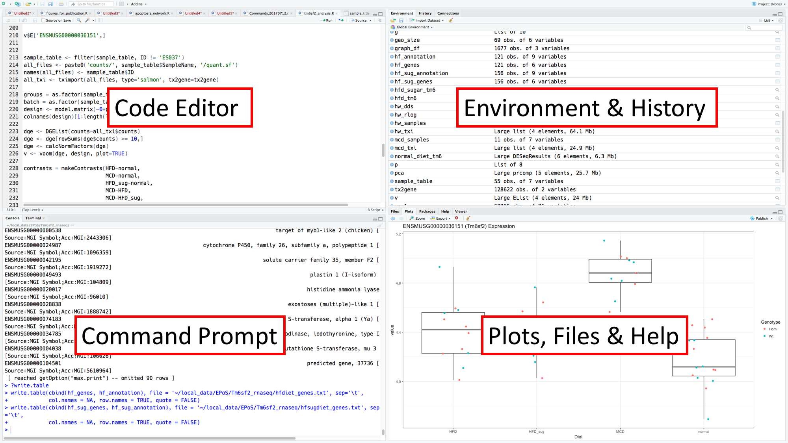
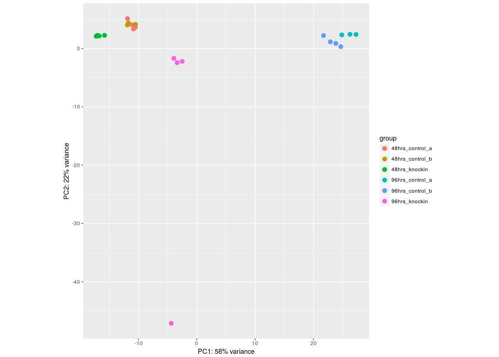
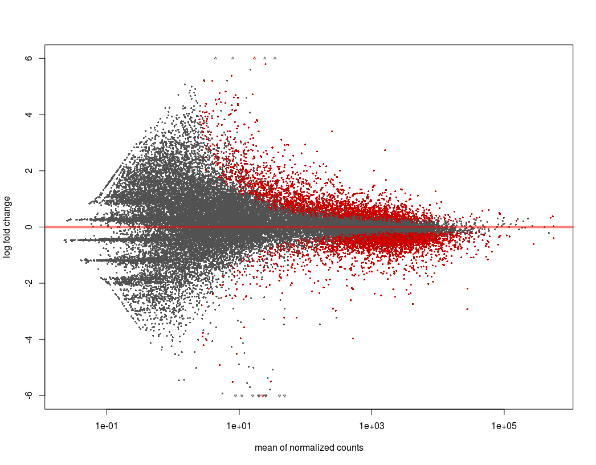

```{r setup, include=FALSE}
knitr::opts_chunk$set(echo = TRUE, cache = TRUE)
library(knitr)
library(DESeq2)
library(pheatmap)
library(gplots)
library(bsudata)
library(tidyverse)
```

## Introduction to R

- Programming language and environment for statistics and visualisation
- Used in bioinformatics lots - enables manipulation and analysis of very large data sets.
- Extensible environment - new functionality added to the core language via packages
- Large existing repositories of packages for R
    - Comprehensive R Archive Network (CRAN)[^1]
    - Bioconductor[^2] - packages for bioinformatics

## Bioconductor

- Open source software project for R
- Collection related R packages for bioinformatics
- Coding and documentation standards

## Tidyverse

- Tidyverse[^3] is set of packages available through CRAN
- “an opinionated collection of R packages designed for data science”
- Components provide convenient methods for reading, writing, visualising and organising data

## RStudio

- RStudio[^4] is an Integrated Development Enviornment (IDE)
- Supports the development and running of R programs
- Has convenience features that makes developing R code much more user-friendly. 

## RStudio

```{r external_pic1, echo=FALSE, out.width='75%'}

```

## Using R

- R is a Turing-complete[^5] programming language
- We will be using R as a command-driven data analysis environment
- Commands we will use in R take a general form:

```{r pseudo1, eval=FALSE}
command(arguments)
```

- Where `arguments` is comma-separated list of input, or things that modify the command's behaviour
- Results can be stored as a _variable_ by using the assignment operator (`=`):

```{r pseudo2, eval=FALSE}
x = command(arguments)
```

- Help can be found using the `?` operator :

```{r pseudo3, eval=FALSE}
?command
```

- Help will open in the bottom right-hand pane of RStudio

## Installing Packages

- See instructions at [bsu.ncl.ac.uk/rinstall](http://bsu.ncl.ac.uk/rinstall)
- We need a small number of packages for today's exercise

```{r installer, eval=FALSE}
install.packages('devtools')
install.packages('pheatmap')
install.packages('tidyverse')
install.packages('gplots')
```

- To make use of packages, include in your session with `library()` command

```{r libraries, eval=FALSE}
library('devtools')
# now use this package to install 1 final requirement
install_github('Bioinformatics-Support-Unit/bsudata')
```

## Introduction to RNA-Seq

- Sequencing of cDNA in order to profile the RNA content of a sample
The number of reads that map to a particular gene is in direct proportion
    - its length
    - the amount of that molecule present in the sample
- Given a number of samples we can 
    - normalise for transcript lengths and total number of reads
    - work out which species are differentially expressed between groups of samples

## RNA-Seq Experimental Design

- Enrichment of RNA of interest
    - polyA enrichment or rRNA depletion
- Replicates
    - Vital for statistical power
    - At least n=4
    - Many more for patient experiments & complicated designs
- Sequencing depth
    - Depends on question but
    - polyA enriched RNA: >10M single end reads
    - rRNA depleted RNA: >50M paired end reads

## TPM

- Transcripts per Million (mapped reads)
- A way of expressing the normalised read counts
- To calculate TPMs for a sample, you do the following:
  
1. Divide the read counts by the length of each gene in kilobases. This gives you reads per kilobase (RPK).
1. Count up all the RPK values in a sample and divide this number by 1,000,000. This is your “per million” scaling factor.
1. Divide the RPK values by the “per million” scaling factor. This gives you TPM.

## The Dataset

- Human cell line RNA-Seq dataset
- Six conditions
    - Gene Knock-In
    - Control A
    - Control B
    - Each at 48 and 96hrs
- n=4 - except one condition (96hrs control A) where n=3
- 100-bp paired-end data from an Illumina HiSeq 2500

## Quantification of RNA-Seq Data

- Quantification data produced using Salmon[^6]
- Performs ‘quasi-alignment’ to quantify transcript expression via read abundances

```{bash run_salmon, eval=FALSE}
#!/bin/bash
wget ftp://ftp.ebi.ac.uk/pub/databases/gencode/Gencode_human/release_27/gencode.v27.transcripts.fa.gz
salmon index -i salmon.idx -t gencode.v27.transcripts.fa
vals=($(seq 1 1 23))
for i in ${vals[@]}; do
  salmon quant -i /data/rna-seq-course/salmon.idx -l A \ 
    -1 fastq/Sample${i}_R1_001.fastq.gz \ 
    -2 fastq/Sample${i}_R2_001.fastq.gz \ 
    -o ~/rna-seq/counts/Sample${i}
done
```

## Importing data into R

- Raw count data imported into R as a gene-level count matrix
- Via the Bioconductor package `tximport`.

```{r tximport, eval=FALSE}
library(tximport)
# where count_files is a named vector of file names:
quant_table = tximport(count_files, 
                       type="salmon", 
                       tx2gene=gene_map, 
                       ignoreTxVersion=TRUE)
```

## Analysing Count Data

- Use `DESeq2` package[^7] to analyse the count data for differentially expressed genes
- Uses statistics based on the negative binomial distribution

```{r DESeq, eval=FALSE}
library(DESeq2)
deseq_data = DESeqDataSetFromTximport(txi=quant_table,
          colData=sample_table, design = ~ treatment)
deseq_data = DESeq(deseq_data)
```

## Principal Component Analysis

- Used to examine the ordination of the samples
    - Gives an idea of how similar samples are to one another
    - And if any need to be excluded as outliers
- Techniques such as Prinicpal Component Analysis (PCA) are used for this[^8]
    - Other examples:
        - Multi-Dimensional Scaling (MDS)
        - t-Distributed Stochastic Neighbor Embedding (t-SNE)

```{r pca, eval=FALSE}
rlog_data = rlogTransformation(deseq_data, blind=TRUE)
plotPCA(rlog_data, intgroup=c("treatment"))
```

## Principal Component Analysis

```{r external_pic2, echo=FALSE, out.width='50%'}

```

## Determining Differentially Expressed Genes

- Differentially expressed genes extracted by `results()` from `DESeq2`
- Results arguments:

1. The dataset you want to analyse (created as per the above)
1. A list of the conditions you want to analyse:
    i. The relevant column of the sample table
    i. The numerator condition
    i. The denominator condition (by convention the control)

```{r DESeq_results, eval=FALSE}
result_table = results(deseq_data, 
                       contrast = c("treatment", "96hrs_knockin", "96hrs_control_b"))
```

## MA Plot

- Provides a useful overview of a two-group comparison
- Mean normalised count on the x-axis
- log2 fold change on the y
- Points coloured according to whether they are significantly differentially expressed

```{r maplot, eval=FALSE}
plotMA(result_table, alpha=0.05, ylim=c(-6,6))
```

## MA Plot

```{r external_pic3, echo=FALSE, out.width='50%'}

```

# Making Heatmaps from RNA-Seq data

## The Data

All the data we will need for today's exercise is provided in the `bsudata` package you should have already installed. 

You can list, attach, and take a look at any of the data in the package:

```{r head_data, eval=FALSE}
library(bsudata)
# list available data
data(package="bsudata")
# attach specific dataset
data("count_table")
# take a peek at this data
head(count_table)
```

## Gene Expression Heatmap
### Format the data

- Heatmaps of gene expression values and fold changes 
- top 20 differentially expressed genes for one comparison
    - 96 hrs knock-in vs control B
- Briefly, this is how the data was prepared:

```{r data_transform, eval=TRUE}
# Get the normalised count table
data("count_table")
# Get the full list of differentially expressed genes
data("T96_vs_B_sig")
# Select the 'top 20' - the genes are ordered by fold change
top20_genes = slice(T96_vs_B_sig, 1:20)
# Extract the counts for the top 20 genes
top20_ensembl = pull(top20_genes, ensembl_geneid)
top20_counts = slice(count_table, match(top20_ensembl, count_table$ensembl_geneid))
# Transform these counts into a matrix, for making heatmaps
top20_tib = select(top20_counts, -starts_with("ensembl"))
top20_matrix = as.matrix(top20_tib)
rownames(top20_matrix) = pull(top20_genes, symbol)
```

## Gene Expression Heatmap
### Base heatmap

Time to get your hands dirty:

```{r heatmap1, eval=TRUE}
data("top20_matrix")
heatmap(top20_matrix)
```

## Gene Expression Heatmap
### Problems to fix

This default function has several problems that it would be good to resolve. 

1. Every row is scaled to its own minimum and maximum, making comparisons between rows impossible
1. There is no colour scale provided. How do we know what each colour in the plot represents?
1. The `heatmap` function doesn't provide us with easy ways of resolving these issues (it is difficult to configure)

## Gene Expression Heatmap
### pheatmap

- Alternative heatmap implementation to fix above problems 
- Many available
    - `heatmap.2` (in the `gplots` package)[^9]
    - `ComplexHeatmap`[^10]
    - `superheat`[^11]
    
For the purposes of this tutorial, we're going to use the `pheatmap` package[^12], which you should have already installed. 

## Gene Expression Heatmap
### pheatmap

```{r heatmap2, eval=TRUE}
library(pheatmap)
pheatmap(top20_matrix)
```

## Gene Expression Heatmap
### Still problems to fix

The defaults of `pheatmap` are preferable to base `heatmap`, but:

1. The range of the data is very skewed
1. `pheatmap` uses a diverging colour scale by default

## Gene Expression Heatmap
### Transform the data

To correct the skew, apply a `log` transform:

```{r heatmap3, eval=TRUE}
transformed_counts = log2(top20_matrix + 1)
pheatmap(transformed_counts)
```


## Gene Expression Heatmap
### Change the colour scheme

- Create a new list of colours
    - Using the `colorpanel` function from the `gplots` package
        - n = number of colours
        - low = colour at position 1
        - high = colour at position n
        - mid (optional) = colour at n/2
- `colorpanel` calculates smooth interpolation of colours between low and high
    - via mid if included

## Gene Expression Heatmap
### Change the colour scheme

```{r heatmap4, eval=TRUE}
library(gplots)
mycolours = colorpanel(n=100, low='blue', high='white')
pheatmap(transformed_counts, color = mycolours)
```

## Fold Change Heatmap
### Basic heatmap

- It can be useful to see how a set of genes are varying across many analyses
- A fold change heatmap can be informative 
- In the `bsudata` package
    - a matrix of fold changes
    - for the top 20 genes plotted above
    - across 4 comparisons in the experiment
        - knock-in vs control A and control B at 48 and 96 hours

## Fold Change Heatmap
### Basic heatmap

```{r heatmap5}
data("fc_matrix")
pheatmap(fc_matrix)
```

## Fold Change Heatmap
### Mo' problems

Two main things to address:

1. The 'inflection point' - the scale is not symmetrical about 0
1. The colour scheme

## Fold Change Heatmap
### Symmetrical scale

- Set 'breaks'
- The points along the numerical scale at which the colour being used changes
- Need number of colours (default 100) + 1 breaks

## Fold Change Heatmap
### Symmetrical scale

```{r heatmap6}
# get the largest number in the fold change matrix
big_fc = max(abs(fc_matrix))
# set the breaks to move evenly between 
# the negative and positive versions of this number
hm_breaks <- seq(-big_fc, big_fc, length.out = 101)
# now use these breaks to draw the heatmap
pheatmap(fc_matrix, breaks=hm_breaks)
```

## Fold Change Heatmap
### Colour scheme

- Bolder colour scheme
- Blue for negative fold change
- Red for positive fold change

## Fold Change Heatmap
### Colour scheme

```{r heatmap7}
mycolours2 = colorpanel(n=100, low='blue', mid='white', high='red')
pheatmap(fc_matrix, breaks=hm_breaks, color = bluered(100))
```


[^1]: https://cran.r-project.org
[^2]: https://bioconductor.org
[^3]: https://www.tidyverse.org
[^4]: https://www.rstudio.com
[^5]: https://en.wikipedia.org/wiki/Turing_completeness
[^6]: https://www.nature.com/articles/nmeth.4197
[^7]: https://genomebiology.biomedcentral.com/articles/10.1186/s13059-014-0550-8
[^8]: https://www.nature.com/articles/nbt0308-303
[^9]: https://cran.r-project.org/web/packages/gplots/index.html
[^10]: https://bioconductor.org/packages/release/bioc/html/ComplexHeatmap.html
[^11]: https://rlbarter.github.io/superheat/index.html
[^12]: https://cran.r-project.org/web/packages/pheatmap/index.html